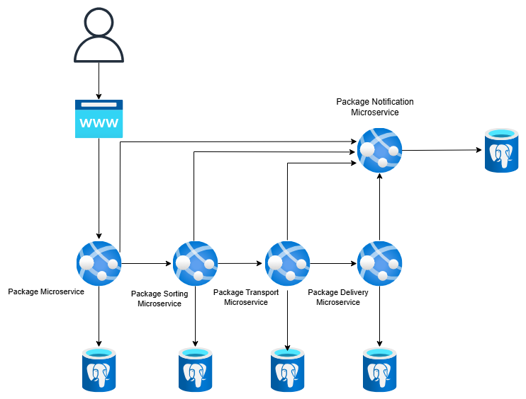
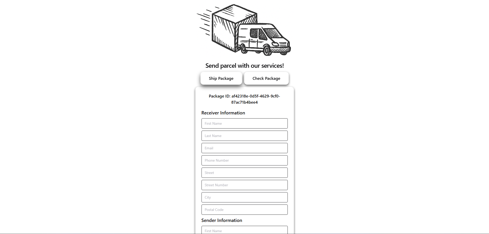
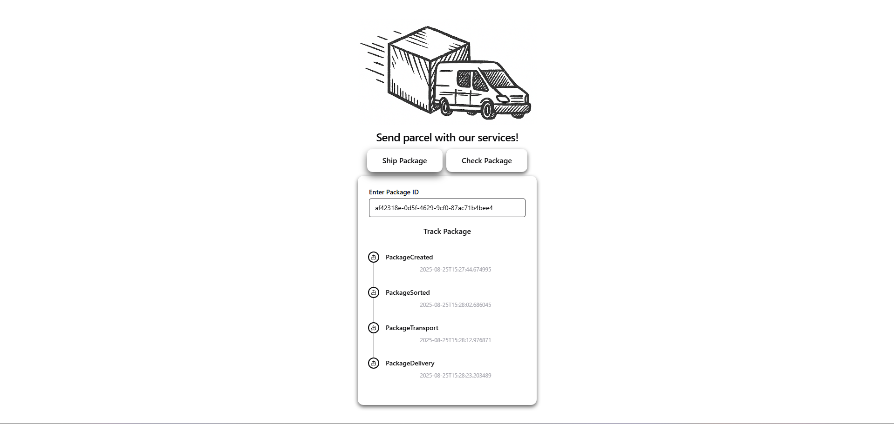

# Package simulation kafka

The project is designed to simulate how the proccess of posting package at shipping companies might look.<br>
Project is created with a use of Spring Boot and Kafka. <br>
Eachservice is separated into microservice. <br>
There are 5 microservices:

- Package Service - accepts input from frotend's form and sends it to backend. Service proccess data - adds necessary data to DB and sends topic to Kafka.
- Package Sorting - consumes data that was sent by previous microservice, process it and sends topic to another service.
- Package Transport - consumes data that was sent by previous microservice, process it and sends topic to another service.
- Package Delivery - consumes data that was sent by previous microservice, process it and sends topic to another service.
- Package Notification - accepts id of package from frontend and gather all topics saves events to DB and return all events that occured before the search.

## Technologies

- Spring Boot - serve microservices
- Apache Kafka - to communicate async between microservices
- Postgresql - to store data
- React - simple react page to interact with server

## Architecture

Each microservice works independently - meaning it can be extended, scaled and maintained without interference with other service. <br>
Communication between microservices take place only between Kafka. <br>
Event-Driven architecture - Each step of package is being published and next microservices reacts to that event.



## Page




# How to run program?

Firstly run db in docker:

```bash
docker run -itd --name package-postgres -e POSTGRES_USER=myuser -e POSTGRES_PASSWORD=mypassword -p 5432:5432 -d postgres
```

Run Kafka in docker (no need for zookeeper)

```bash
docker pull apache/kafka:4.0.0

docker run -p 9092:9092 apache/kafka:4.0.0
```

Then build .jar files with .sh script

```bash
./build-services.sh
```

And run .jar files

```bash
./start-services.sh
```

To run frontend

```bash
cd frontend
npm install
npm run dev
```
